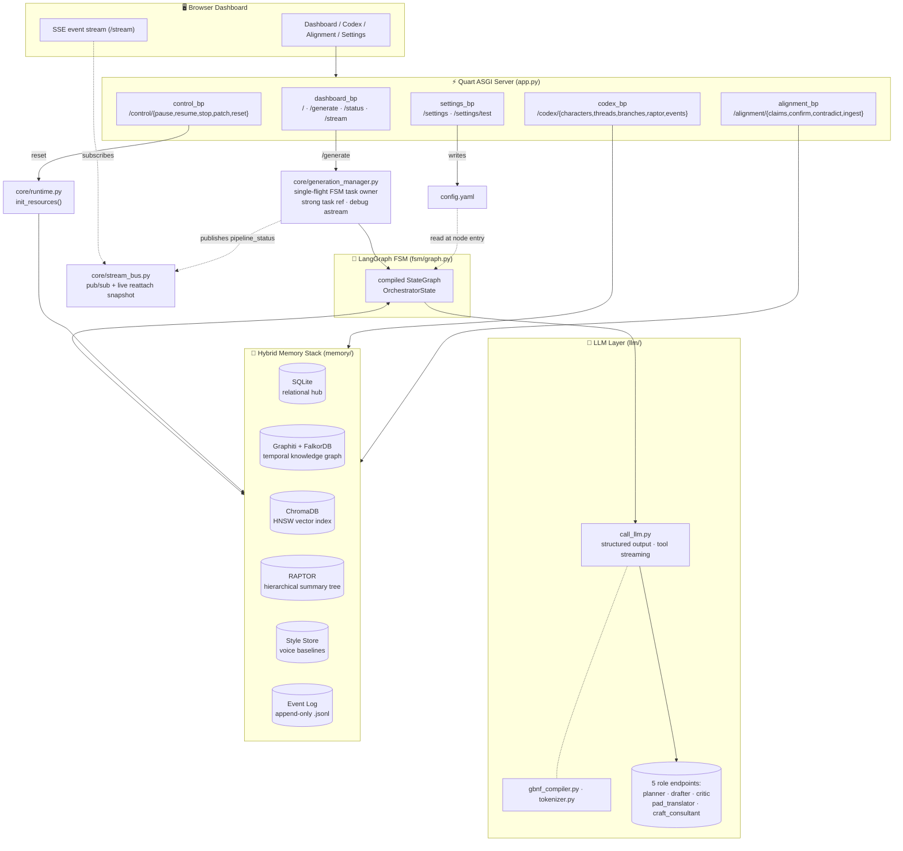
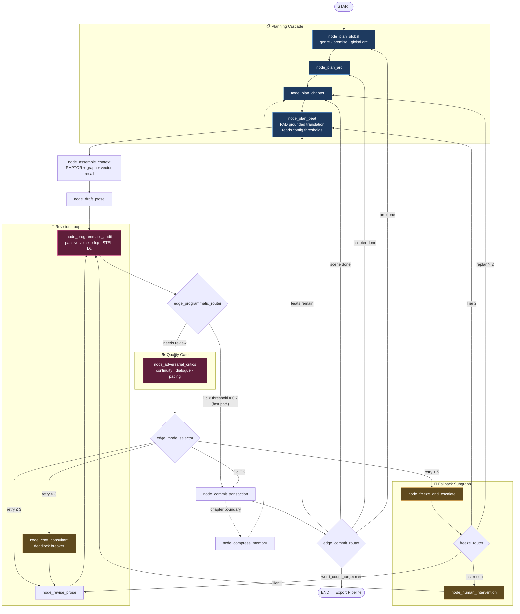
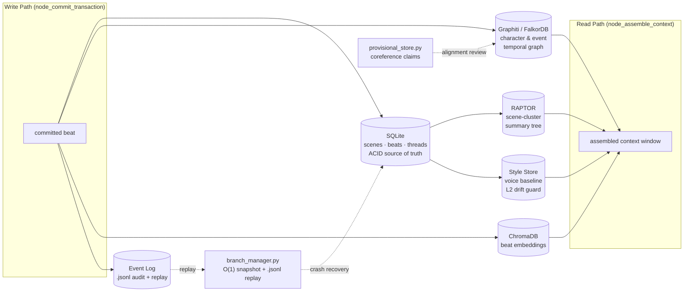

# FictionWriter

An autonomous long-form fiction generation engine built on a **LangGraph finite-state
machine**. A planning cascade decomposes a premise into arcs → chapters → scenes → beats,
each beat is drafted, audited programmatically, gated by a panel of adversarial critics,
and revised in a closed loop until it clears quality thresholds — then committed to a
six-store hybrid memory stack and streamed live to a Quart dashboard.

## System Architecture



## FSM Generation Pipeline

The heart of the system. Nodes are wired in `fsm/graph.py`; conditional routing lives in
`fsm/routers/`. Solid arrows are unconditional edges; diamonds are router functions.



### Routing thresholds (`config.yaml`)

| Router | Decision | Threshold key |
| --- | --- | --- |
| `edge_programmatic_router` | fast-path bypass of critics | `stel_cosine_distance × programmatic_fast_path_multiplier` (0.12 × 0.7) |
| `edge_mode_selector` | revise vs. consult vs. freeze | `craft_consultant_threshold` (3), `retry_count_max` (5) |
| `freeze_router` | re-plan tier escalation | `replan_count_max` (2) |
| `edge_commit_router` | manuscript complete | `word_count_target` (2000) |

## Hybrid Memory Stack

All six stores are file-based and reinitialized atomically by `core/runtime.py`
(`init_resources()` at boot, and again on `POST /control/reset`).



## Quick Start

```bash
# 1. start the FalkorDB knowledge-graph server
docker compose up -d

# 2. configure LLM endpoints (copy and edit per-role keys)
cp .env.example .env

# 3. run the async server
uv run app.py        # → http://localhost:5000
```

Open the dashboard, set the premise/genre in **Settings** (writes back to `config.yaml`,
picked up at the next beat boundary), and click **Generate**. The pipeline runs
server-side regardless of page focus — reload at any time to reattach to the live stream.

## Project Layout

| Path | Responsibility |
| --- | --- |
| `app.py` | Quart application factory, blueprint registration, startup lifecycle |
| `config.yaml` | All runtime thresholds and per-role LLM endpoint config (validated, `extra='forbid'`) |
| `core/` | Config loader, runtime resource lifecycle, generation manager, SSE stream bus, antislop |
| `fsm/` | LangGraph state graph, nodes, conditional routers, `OrchestratorState` |
| `llm/` | `call_llm` (structured output + tool streaming), GBNF compiler, tokenizer |
| `memory/` | The six persistent stores + branch/provisional managers |
| `ingestion/` | Non-blocking sliding-window ingestion + coreference resolution |
| `routes/` | Blueprints: dashboard, control, codex, alignment, settings |
| `prompts/` | Jinja2 XML node prompt templates + loader |
| `evals/` | Manuscript generator, error injection, LLM judge, runner |
